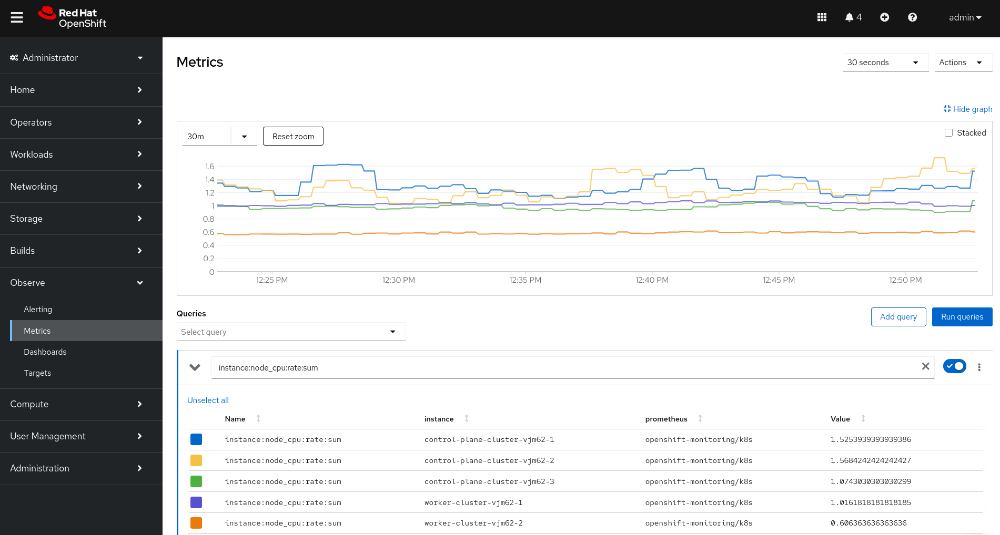

= Hands-on lab: Exploring the OpenShift monitoring stack

== Check cluster operators health

[source,bash]
----
oc get clusteroperators
----

Identify any degraded or progressing operators:
[source,bash]
----
oc get co -o jsonpath='{range .items[*]}{.metadata.name}: {.status.conditions[?(@.type=="Degraded")].status}{"\n"}{end}'
----

== Use oc adm top to inspect resource usage

Display node resource consumption:

[source,bash]
----
oc adm top nodes
----
----
NAME                            CPU(cores)   CPU%        MEMORY(bytes)   MEMORY%
control-plane-cluster-vjm62-1   1190m        7%          11489Mi         37%
control-plane-cluster-vjm62-2   1134m        7%          9270Mi          29%
control-plane-cluster-vjm62-3   1455m        9%          5783Mi          18%
worker-cluster-vjm62-1          2096m        13%         8249Mi          26%
----

Display main pod offenders across all namespaces:
[source,bash]
----
oc adm top pods -A | head
----
----
NAMESPACE                                          NAME                                                           CPU(cores)   MEMORY(bytes)
openshift-apiserver                                apiserver-6df4569b8c-mts6l                                     21m          485Mi
openshift-apiserver                                apiserver-6df4569b8c-w858d                                     41m          471Mi
openshift-apiserver                                apiserver-6df4569b8c-x7ftk                                     15m          498Mi
openshift-apiserver-operator                       openshift-apiserver-operator-b9ff4697-vwsm2                    21m          227Mi
openshift-authentication                           oauth-openshift-55479d787c-4zrx4                               4m           99Mi
openshift-authentication                           oauth-openshift-55479d787c-l562w                               3m           104Mi
openshift-authentication                           oauth-openshift-55479d787c-lvjcs                               6m           100Mi
openshift-authentication-operator                  authentication-operator-576f97686b-9hpfb                       98m          211Mi
openshift-catalogd                                 catalogd-controller-manager-5fd54d45c8-qdlpb                   2m           107Mi
----

== Collect a Must-Gather bundle

This bundle contains operator logs, metrics service status and overall cluster diagnostics:
[source,bash]
----
oc adm must-gather
----

== Prometheus

Access the OpenShift Console and navigate to *Observe*.

=== Dashboards

Navigate to *Observe* -> *Dashboards* for some great default dashboards, including the *API Performance* one showcasing API request durations, rates, long running requests, registered watchers, etc:

.Built-in API Performance dashboard
image::images/prom-dashboard.png[width=700]

=== Inspect Prometheus Targets

To verify which components are being scraped, navigate to *Observe* -> *Targets*:

.Prometheus Targets
image::images/prom-targets.png[width=700]

=== Query Cluster Metrics Using PromQL

Navigate to *Observe* -> *Metrics*:

.Custom queries with PromQL

Useful PromQL Queries You Should Know:

[cols="1,2", options="header"]
|===
| Description | PromQL Query

| Node CPU usage
| `instance:node_cpu:rate:sum`

| API server request latency
| `apiserver_request_duration_seconds_bucket{verb="GET",scope="resource"}`

| etcd operation latency
| `etcd_request_duration_seconds_bucket`

| Pod restart count
| `kube_pod_container_status_restarts_total`

| Network receive throughput (per node)
| `node_network_receive_bytes_total`
|===

